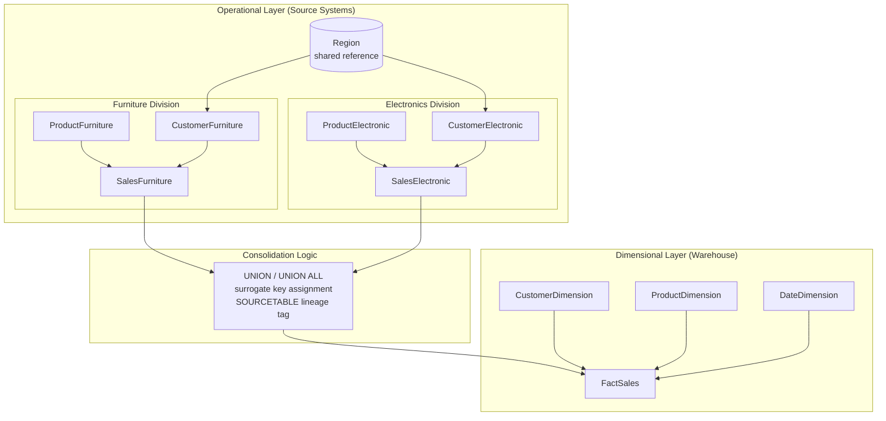

# Retail Sales Database and Dimensional Data Warehouse Design


Relational database implementation and dimensional warehouse design for a retail company operating two independent sales systems. The project covers the full path from operational schema through analytical queries to a consolidated star schema suitable for business intelligence reporting.

## Project Description

A retail business records its sales in two separate operational databases — one for furniture and one for electronics. Each system maintains its own products, customers and sales transactions, with a shared regional reference. The two systems cannot answer questions that span both product lines, which is precisely what management needs for profitability and customer analysis.

This project delivers three artefacts:

1. **An operational (OLTP) implementation** — seven Oracle tables with correct data types, primary keys and referential integrity, populated with the supplied transaction data.
2. **An analytical query suite** — twelve SQL statements progressing from basic filtering to cross-system `UNION` aggregation, window-function ranking, and `ROLLUP`/`CUBE` multidimensional summaries.
3. **A dimensional (OLAP) star schema** — a consolidated warehouse design that merges both source systems into a single fact table with conformed dimensions, resolving the cross-system reporting gap.

Intended readers are database developers, data engineers and analysts evaluating relational modelling, advanced SQL, and dimensional design capability.

## What Problem Does It Solve?

**The real-world problem.** The company's furniture and electronics divisions run on isolated schemas. Product identifiers even use different data types — `VARCHAR2(10)` codes such as `A18` in furniture versus `NUMBER(10)` codes in electronics. Any question that crosses both divisions ("which products are most profitable across the whole business?", "how does each region perform overall?") cannot be answered without manual reconciliation.

**Existing limitations.**

- No single query surface spans both divisions; every cross-division report requires manual consolidation.
- Incompatible key types prevent a naive join between the two systems.
- `SALEDATE` is nullable in both sales tables, so time-series reporting silently drops transactions.
- Normalised OLTP structure requires multi-table joins for every analytical question, which is slow and awkward for reporting tools.
- The system flags no notion of profitability; gross margin must be recomputed from cost and price on every query.

**Why this was developed.** The work demonstrates the standard progression from transactional storage to analytical storage. The `UNION`-based queries prove that cross-system reporting is possible but verbose and fragile; the star schema then shows the durable solution.

**Benefits of the solution.**

- Referential integrity constraints prevent orphaned sales records at the source.
- Surrogate keys in the warehouse absorb the incompatible source key types, so both divisions coexist in one fact table.
- A `SOURCETABLE` attribute on each dimension preserves division lineage after consolidation, allowing drill-down back to origin.
- Pre-computed `TOTALREVENUE` and `GROSSMARGIN` measures remove repeated arithmetic from reporting queries.
- A dedicated date dimension makes time-based slicing straightforward, and a data-quality fix enforces `NOT NULL` on sale dates.

## Tech Stack

| Category | Technologies |
| --- | --- |
| Database | Oracle Database |
| Query Language | Oracle SQL (PL/SQL dialect) |
| Data Modelling | Entity Relationship Diagram, Star Schema |
| SQL Features | DDL constraints, `UNION` / `UNION ALL`, CTEs (`WITH`), `RANK() OVER (PARTITION BY …)`, `GROUP BY ROLLUP`, `GROUP BY CUBE`, `ROWNUM` top-N, `TO_DATE` |
| Documentation | PDF specification, PNG diagrams |

## Methodology

### System architecture



### Operational schema design

Seven tables were implemented with data types matched to the source specification. `Region` is shared by both divisions. Each division has its own product, customer and sales tables, wired with named foreign key constraints:

| Constraint | Enforces |
| --- | --- |
| `fk_custfurn_region`, `fk_custelec_region` | Every customer belongs to a valid region |
| `fk_salesfurn_prod`, `fk_saleselec_prod` | Every sale references an existing product |
| `fk_salesfurn_cust`, `fk_saleselec_cust` | Every sale references an existing customer |

Tables are dropped with `CASCADE CONSTRAINTS` before creation so the script is idempotent and re-runnable. Data insertion uses the `SELECT … FROM DUAL UNION ALL` pattern, which loads multiple rows in a single statement — the standard Oracle idiom where multi-row `VALUES` is unavailable.

### Analytical query progression

The twelve queries build in complexity:

| Stage | Technique | Purpose |
| --- | --- | --- |
| Filtering | `WHERE … OR … IS NULL`, `ORDER BY … DESC` | Retrieve sales on or before a date, including undated rows |
| Row arithmetic | `QTY * SALEPRICE` | Per-transaction sales totals |
| Aggregation | `JOIN` + `GROUP BY` + `SUM` | Total sales per product name |
| Cross-system union | `UNION` across both divisions | Combined quantity and gross margin across product lines |
| Ranking | `WITH` CTE + `RANK() OVER (PARTITION BY Category ORDER BY GrossMargin DESC)` | Profitability rank within each category |
| Multidimensional | `GROUP BY ROLLUP`, `GROUP BY CUBE` | Subtotals and grand totals by customer and product |
| Top-N | Inline view + `ROWNUM <= 2` | Two highest-revenue electronic products with distinct customer counts |
| Integrity demonstration | Deliberate FK violation | Proves the constraint layer rejects invalid references |
| Schema evolution | `UPDATE` nulls, then `ALTER TABLE … MODIFY … NOT NULL` | Backfills missing sale dates before tightening the constraint |

Gross margin is computed throughout as `QTY * (SALEPRICE - PURCHASECOST)`, joining each sale to its product to obtain unit cost.

### Dimensional model design

The star schema collapses the six division-specific tables into one fact table surrounded by three conformed dimensions:

| Table | Grain / Role | Key attributes |
| --- | --- | --- |
| `FactSales` | One row per sales transaction (both divisions) | `SALESSK` (PK); `PRODUCTSK`, `CUSTOMERSK`, `DATESK` (FK); `QUANTITY`, `SALEPRICE`, `TOTALREVENUE`, `GROSSMARGIN`, `SOURCETABLE` |
| `ProductDimension` | One row per product | `PRODUCTSK` (PK), `PRODUCTID`, `PRODUCTNAME`, `PURCHASECOST`, `SOURCETABLE` |
| `CustomerDimension` | One row per customer | `CUSTOMERSK` (PK), `CUSTOMERID`, `CUSTOMERNAME`, `MYIC`, `GENDER`, `REGIONNAME`, `SOURCETABLE` |
| `DateDimension` | One row per calendar day | `DATESK` (PK), `FULLDATE`, `DAY`, `MONTH`, `YEAR` |

Three design decisions carry the model:

- **Surrogate keys.** `PRODUCTSK` and `CUSTOMERSK` are warehouse-generated integers. This is what makes consolidation possible at all, since the source systems use incompatible natural key types. The original identifier is retained as `PRODUCTID` / `CUSTOMERID` for traceability.
- **Dimension denormalisation.** `REGIONNAME` is folded into `CustomerDimension` rather than kept as a separate table, eliminating a join on every regional query — the standard star-schema trade-off of storage for query simplicity.
- **Pre-computed measures.** `TOTALREVENUE` and `GROSSMARGIN` are materialised in the fact table so reporting tools aggregate rather than recompute.

## Result

### Delivered artefacts

| File | Contents |
| --- | --- |
| `102782025_SQL.sql` | Complete script — DDL for seven tables, data population, twelve analytical queries with inline explanation, and the `NOT NULL` schema migration |
| `102782025_ERD.png` | Entity relationship diagram of both operational systems with full data-type annotation and PK/FK cardinality |
| `102782025_StarSchema.png` | Dimensional model showing `FactSales` with its three conformed dimensions |
| `102782025_Star.pdf` | Written documentation of the dimensional design |

### Operational database

| Entity | Furniture | Electronics |
| --- | --- | --- |
| Products | 2 (Sofa, Dining table) | 3 (Microwave, Water heater, Television) |
| Customers | 3 | 3 |
| Sales transactions | 8 | 32 |
| Regions | 3 shared (Sarawak, Sabah, Semenanjung) | |

### Query outcomes

- **Cross-division profitability ranking** produced a single ordered list of all five products with category labels and a within-category rank, derived from two structurally incompatible source systems.
- **Top-N revenue analysis** identified the two highest-revenue electronic products together with their distinct customer counts, restricted to dated transactions only.
- **`ROLLUP` and `CUBE`** generated per-customer, per-product, and grand-total quantity summaries in single statements, with explicit `NULLS FIRST` / `NULLS LAST` ordering to place subtotal rows correctly.
- **Referential integrity was verified** by an intentional insert referencing `CUSTNO = 99`, which does not exist in `CustomerElectronic` (valid values are 1, 2, 3). Oracle rejected the statement, confirming the constraint layer functions as designed.
- **Data quality was remediated** — five transactions carried `NULL` sale dates. These were backfilled to `20-AUG-15`, after which `ALTER TABLE … MODIFY SALEDATE DATE NOT NULL` was applied to both sales tables, preventing recurrence.

### Design outcome

The star schema reduces every cross-division analytical query from a two-branch `UNION` over six tables to a single fact-table aggregation with at most three dimension joins.

## Project Structure

```
.
├── 102782025_SQL.sql          Full Oracle SQL script (DDL, DML, 12 analytical queries)
├── 102782025_ERD.png          Operational ERD — both divisions, typed attributes
├── 102782025_StarSchema.png   Dimensional star schema diagram
├── 102782025_Star.pdf         Star schema design documentation
└── README.md
```

## Usage

The script targets Oracle Database and can be executed in SQL*Plus, SQL Developer, or Oracle Live SQL.

```sql
-- Run the complete script
@102782025_SQL.sql
```

To execute in stages, the script is divided by question with comment headers:

```sql
-- Section 1: schema creation (DROP + CREATE for 7 tables)
-- Section 2: data population (Region, Products, Customers, Sales)
-- Section 3: analytical queries (Q4 – Q11)
-- Section 4: constraint demonstration (Q12)
-- Section 5: schema migration to NOT NULL (Q13)
```

The initial `DROP TABLE … CASCADE CONSTRAINTS` statements will report errors on a clean schema where the tables do not yet exist. This is expected; execution continues normally.

> Note: `Q13` permanently alters both sales tables to enforce `NOT NULL` on `SALEDATE`. Re-run the full script from the top to restore the original nullable state.

## Conclusion

**Achievements.** The project delivers a working relational implementation with enforced referential integrity, a query suite spanning basic filtering to multidimensional aggregation, and a dimensional model that resolves the cross-system reporting gap the operational schema cannot address.

**Lessons learned.** The most instructive part was the contrast between the two approaches to the same question. Writing gross margin across both divisions as a `UNION` works, but the query must be authored twice — once per division — and duplicated again for every new analytical question. The star schema makes the same result a single aggregation. Surrogate keys turned out to be the load-bearing decision: without them, the mismatch between `VARCHAR2` and `NUMBER` product identifiers blocks consolidation entirely. The nullable `SALEDATE` was also a useful reminder that permissive source constraints propagate silently into every downstream time-series report.

**Strengths.** Constraints are explicitly named rather than system-generated, making violation messages readable. The script is idempotent. Source lineage survives consolidation through the `SOURCETABLE` attribute. Every query carries an inline comment stating its intent.

**Limitations.** The dataset is small — 40 transactions — so the performance advantages of the dimensional model are argued from structure rather than demonstrated by benchmark. The star schema is a design artefact; no ETL pipeline was built to populate it from the operational tables. The date dimension carries only day, month and year, with no fiscal calendar, quarter or day-of-week attributes. Customer dimension changes are not versioned, so the model has no slowly-changing-dimension strategy.

**Future improvements.** Implementing the ETL that materialises the star schema from the operational tables would close the loop between design and execution. Adding Type 2 slowly-changing-dimension handling to `CustomerDimension` would preserve history when regional assignments change. Extending `DateDimension` with quarter, week and fiscal-period attributes would broaden the reporting surface. Loading a realistic transaction volume would let the query-performance argument be measured rather than asserted.

---

This project demonstrates end-to-end relational and dimensional data modelling — schema implementation with enforced integrity, advanced analytical SQL including window functions and multidimensional aggregation, and the architectural reasoning that separates transactional storage from analytical storage.
